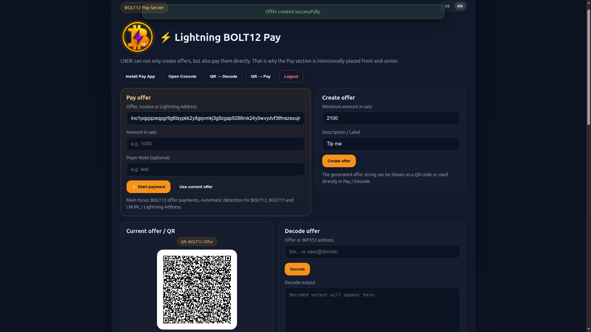
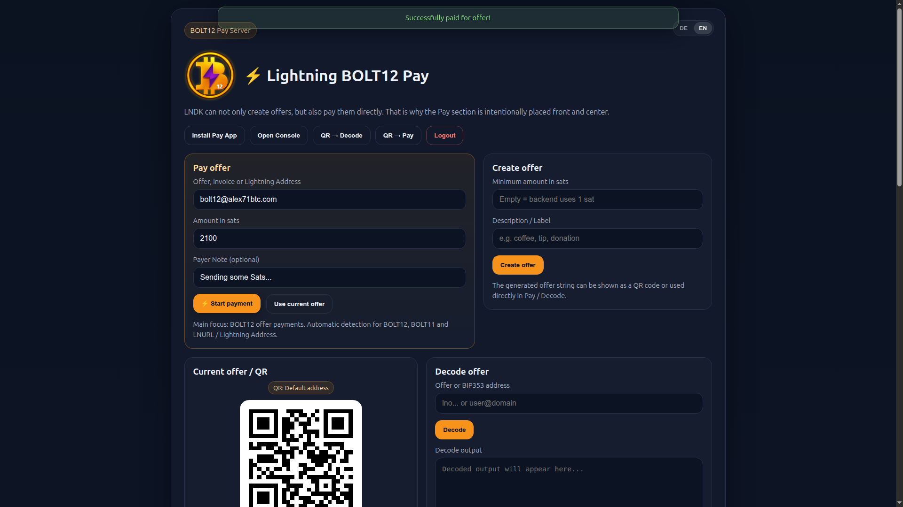
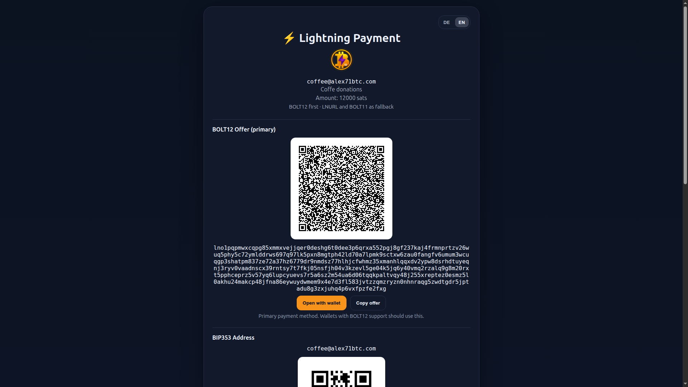
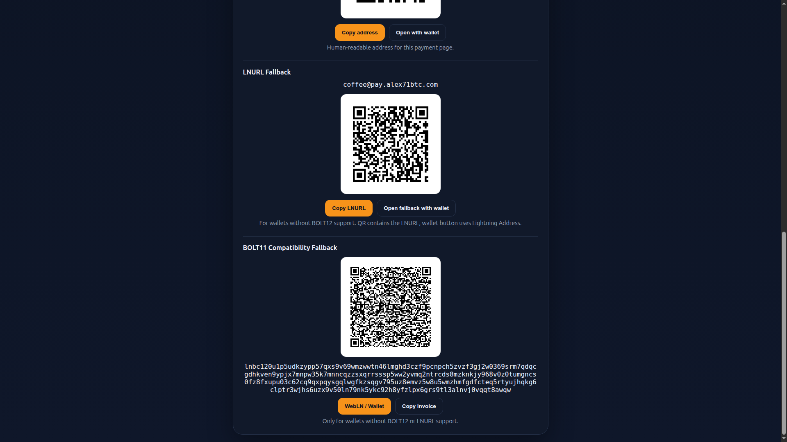
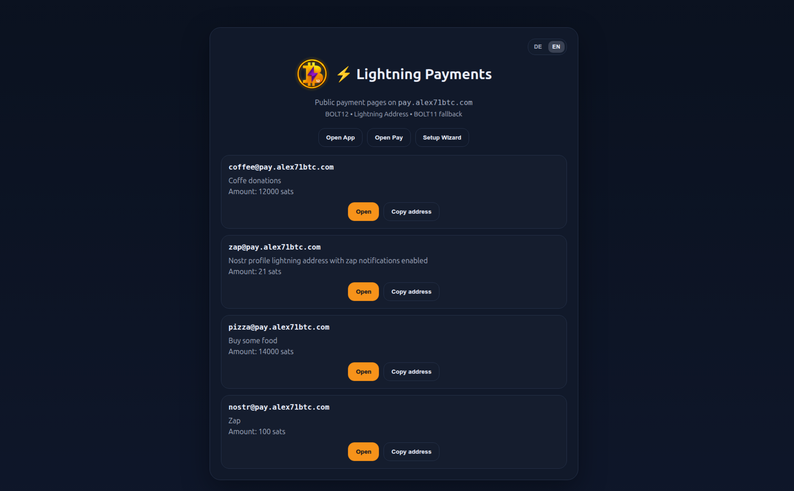

## Setup Guide

### Step 1 — Install

Install BOLT12 Pay from the Umbrel Community App Store.

---

```text
Important for BOLT12 on Umbrel:

Connect via SSH:
ssh umbrel@umbrel.local

Open:
nano ~/umbrel/app-data/lightning/data/lnd/lnd.conf

Add at the end of the file:

[protocol]
custom-message=513
custom-nodeann=39
custom-init=39


Save the file and restart Lightning.

Without this, BOLT12 offers will not work.
---

### Step 3 — Configure App

Open the app and set:

* Public BOLT12 Address
* Lightning Address (LNURL)
* Domain / DNS

---

### Step 4 — Ready

You can now receive:

* BOLT12 payments
* Lightning Address payments
* LNURL payments

All fully self-hosted.

---

### Optional

* Enable Cloudflare DNS automation
* Add Nostr identity for Zaps

⚡ BOLT12 Pay

The first self-hosted app bringing BIP353 Lightning Addresses and native BOLT12 Offer creation and payments to LND nodes, as well as Bolt 11 Lightning Addresses, and Nostr Zaps for LND nodes.

If you own a domain, BOLT12 Pay can turn it into a powerful Lightning Address server and Nostr Zap server with full control over identities, payments, and notifications.

🔥 BREAKING GROUND FEATURES

⚡ BIP353 Lightning Addresses
- Publish human-readable Lightning aliases for your own domain
- Bring next-generation Lightning identity to your LND node
- Cloudflare-powered automatic DNS publishing
- No third-party Lightning Address service required

⚡ BOLT12 Offers on LND (experimental)
- Create BOLT12 Offers directly on LND via LNDK
- Pay BOLT12 Offers from the same interface
- One of the first practical self-hosted Offer workflows for LND nodes
- A major step toward next-generation Lightning UX

⚡ Classic Lightning Address / LNURL Server
- Run your own Lightning Address server
- Compatible with standard LNURL wallets and services
- Fully self-hosted payment endpoint for your domain

⚡ Nostr Features
- Built-in NIP-05 support via .well-known/nostr.json
- Receive and process Nostr Zaps
- Automatic Zap receipt publishing
- Encrypted Zap notifications via Nostr DM
- Multi-relay support

⚙️ Self-hosted by design
- Designed for Umbrel
- Full control over keys, relays, aliases, and identities
- No external APIs required for core operation

🚨 Experimental notice
- BOLT12 support on LND is still experimental
- LNDK integration is cutting-edge and evolving
- Some wallets and clients may not fully support Offers yet

🌍 Why this matters

BOLT12 Pay combines:
- BIP353 Lightning Addresses
- classic Lightning Address / LNURL
- BOLT12 Offers (create + pay)
- Nostr Zaps and NIP-05

…into a single self-hosted stack for Lightning-native identity and payments.

## License

MIT License

Screenshots















